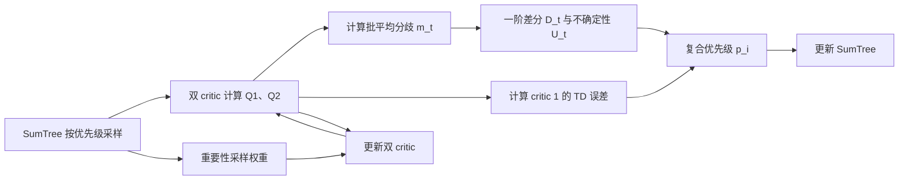

# 基于 TD3-PER 的水下机器人三维路径规划

本项目在 Gymnasium 三维水下环境中训练机器人从原点运动到目标点，并比较 TD3、DDPG、DQN、PPO、SAC 以及三种带优先经验回放（PER）的 TD3 变体。项目的主要方法是 `TD3_PER`：使用双 critic 分歧的**一阶差分**构造不确定性指标，并将其加入经验优先级计算。

## 主要文件

| 文件 | 作用 |
| --- | --- |
| `train.py` | 训练入口，选择算法、地图难度和训练回合数，并保存模型与统计数据 |
| `TD3_S.py` | 一阶差分不确定性版本的 TD3-PER（`TD3_PER`） |
| `PER_Sumtree.py` | 基于 SumTree 的优先经验回放、重要性采样和优先级更新 |
| `TD3_V.py` | 使用逐样本双 critic 分歧的 TD3-PER 对照版本 |
| `TD3_E.py` | 使用多 critic 探针方差的 TD3-PER 对照版本 |
| `underwater_model_env.py` | 三维水下机器人环境、动力学、障碍物、奖励和可视化 |
| `visualize.py` | 训练结果和轨迹可视化 |

## 一阶差分如何影响经验优先级

### 1. TD3 的双 critic 目标

`TD3_S.py` 为每个状态—动作对计算两个当前 Q 值：

```text
Q1(s, a), Q2(s, a)
```

目标网络同样输出两个 Q 值，并取较小者构造 TD 目标，以抑制 Q 值过估计：

```text
y = r + (1 - done) * γ * min(Q1_target(s', a'), Q2_target(s', a'))
```

其中 `γ = 0.99`，目标动作 `a'` 会加入裁剪后的平滑噪声。

### 2. 计算双 critic 分歧及其一阶差分

对当前批次中的每条经验，先计算双 critic 的绝对分歧：

```text
ΔQ_i = |Q1(s_i, a_i) - Q2(s_i, a_i)|
```

再计算该批次的平均分歧：

```text
m_t = mean(ΔQ_i)
```

一阶差分表示相邻两次训练时，批平均双 Q 分歧的变化：

```text
D_t = m_t - m_(t-1)
```

代码使用 `|D_t|`，因此关注的是分歧变化的幅度，而不是增大或减小的方向。第一次训练没有历史值，直接令 `U_t = 1`。

### 3. 用指数移动统计量标准化差分

为避免差分的绝对尺度随训练阶段改变，代码以 `λ = 0.95` 分别维护 `|D_t|` 及其平方的指数移动平均：

```text
E_t[|D|]  = λ E_(t-1)[|D|]  + (1 - λ)|D_t|
E_t[|D|²] = λ E_(t-1)[|D|²] + (1 - λ)|D_t|²
σ_t       = sqrt(max(E_t[|D|²] - E_t[|D|]², 1e-8))
U_t       = (|D_t| + 1e-6) / (σ_t + 1e-6)
```

`U_t` 是当前批次共享的标量，代码会将它广播到批次内的全部经验。`U_t` 越大，说明本次双 critic 分歧相对近期波动尺度变化得越剧烈。

> 一阶差分**不直接修改** `Q1` 或 `Q2`，也不参与 critic 的 TD 目标计算。它先调整经验优先级，再通过后续的采样概率和重要性采样权重，间接改变 critic 看到的训练数据分布。

### 4. 计算并更新复合优先级

优先级更新由 `PER_Sumtree.py` 的 `batch_update()` 完成。TD 误差取 critic 1 的残差：

```text
δ_i = Q1(s_i, a_i) - y_i
```

加入防止零优先级的小常数 `ε = 0.01`，并将误差上限裁剪为 `200` 后，计算：

```text
p_i = min(|δ_i| + ε, 200)^α / (1 + U_t)^β
```

当前参数为：

- TD 误差指数 `α = 0.6`；
- 一阶差分影响指数 `β = 0.6`；
- `U_t` 越大，分母越大，新优先级越低；
- 同一个批次共享同一 `U_t`，所以该批次内部的相对排序主要由 TD 误差决定；不同训练时刻更新的经验则会受到不同 `U_t` 的缩放。

随后 `SumTree.update()` 修改对应叶节点，并把优先级差值逐层传播到根节点，使根节点始终保存全部经验优先级之和。

### 5. 新优先级如何影响后续训练

`PERMemory.sample()` 按以下概率采样经验：

```text
P(i) = p_i / Σ_j p_j
```

总优先级区间会被均分为 `batch_size` 段，并从每一段随机取值，以降低纯随机优先采样的方差。重要性采样权重为：

```text
w_i = (N * P(i))^(-b) / max_j(w_j)
```

其中 `b` 从 `0.4` 开始，每次采样增加 `0.001`，最大为 `1.0`。两个 critic 的损失都乘以该权重：

```text
L1 = mean(w_i * (Q1_i - y_i)²)
L2 = mean(w_i * (Q2_i - y_i)²)
```

critic 更新后会产生新的 Q 值和新的双 Q 分歧，于是形成闭环：



新加入的经验会先获得当前最大优先级；空树中的第一批经验使用 `200`，保证新经验至少有机会被采样一次。

## `train.py` 训练配置

### 可选算法

| `--algorithm` | 实现 | 经验回放/更新方式 |
| --- | --- | --- |
| `TD3` | `td3.py` | 普通 `ReplayBuffer`，缓冲区超过 256 条后逐步训练 |
| `DDPG` | `ddpg.py` | 普通 `ReplayBuffer`，缓冲区超过 256 条后逐步训练 |
| `DQN` | `dqn.py` | 普通 `ReplayBuffer`，缓冲区超过 256 条后逐步训练 |
| `PPO` | `ppo.py` | 回合内保存奖励、下一状态和终止标记，回合结束后更新 |
| `SAC` | `sac.py` | 当前脚本可实例化，但训练循环尚未接入 SAC 的经验存储与 `train()` 调用 |
| `TD3_PER` | `TD3_S.py` | SumTree PER；使用双 critic 分歧的一阶差分 `U` |
| `TD3_V_PER` | `TD3_V.py` | SumTree PER；使用归一化的逐样本 `|Q1-Q2|` 作为 `U` |
| `TD3_E_PER` | `TD3_E.py` | SumTree PER；使用 5 个 critic 探针的预测方差作为 `U` |

默认算法为 `TD3_PER`。TD3 系列在选出的动作上加入标准差为 `0.1 × max_action` 的高斯探索噪声。

### 环境难度

`--difficulty` 支持三个等级：

| 难度 | 球形障碍物数量 | 说明 |
| --- | ---: | --- |
| `easy` | 3 | 障碍物较少 |
| `medium` | 6 | 默认难度 |
| `hard` | 10 | 障碍物最多，空间更拥挤 |

三个难度使用相同的起点 `[0, 0, 0]`、目标点 `[8, 8, 8]` 和水下动力学参数，主要区别是障碍物的数量、位置和半径。

### 回合数和步数

- `--max_episodes`：最大训练回合数，默认 `1000`；
- 每回合最多执行 `1000` 步，该值在 `train.py` 中固定；
- 碰撞或进入目标点半径 `0.5 m` 内时提前结束当前回合；
- TD3-PER 变体在经验数超过 `256` 后开始训练，默认批大小也是 `256`。

### 启动示例

项目原配置使用 Python 3.10。安装主要依赖：

```bash
pip install numpy torch gymnasium matplotlib
```

运行默认的一阶差分 TD3-PER：

```bash
python train.py --algorithm TD3_PER --difficulty medium --max_episodes 1000 --run_id run1
```

启动后程序会先显示初始三维环境，并等待按下回车再开始训练。默认输出目录为：

```text
result/runs/<run_id>/<algorithm>_<difficulty>/
├── models/    # actor、critic 权重
└── data/      # 奖励、路径长度、耗时、最终轨迹、环境配置和训练统计
```

## `underwater_model_env.py` 主要函数

### `__init__(difficulty='medium')`

初始化环境参数和空间：

- 动作空间为 3 维连续向量，每一维范围为 `[-1, 1]`，分别控制三个方向的推进力；
- 观测空间为 9 维：机器人位置 3 维、速度 3 维、最近障碍物相对位置 3 维；
- 设置水密度、阻力系数、质量、体积、横截面积、重力和 `0.1 s` 仿真步长；
- 设置随机环境扰动和人工势场（APF）参数；
- 根据难度生成球形障碍物。

### `_generate_obstacles()`

根据 `easy`、`medium` 或 `hard` 返回球形障碍物字典。每个障碍物包含三维中心坐标和半径。

### `reset(seed=None)`

将位置和速度重置为零，清空上一步的扰动力、APF 合力和 APF 奖励，并返回初始 9 维观测及空信息字典。传入 `seed` 可复现实验中的环境随机扰动。

### `step(action)`

执行一个仿真步，是环境的核心流程：

1. 将归一化动作乘以 `20` 转换为推进力；
2. 叠加随机环境扰动力和 APF 合力；
3. 更新速度，并施加水阻力和浮力；
4. 根据 `dt = 0.1 s` 更新位置；
5. 将位置裁剪到 `[-10, 10]`，速度裁剪到 `[-2, 2]`；
6. 检查碰撞、计算奖励，并判断是否到达目标；
7. 返回 `(observation, reward, terminated, False, info)`。

### `_apply_water_resistance()` 与 `_apply_buoyancy()`

- `_apply_water_resistance()` 使用与速度大小和速度向量相关的二次阻力模型降低速度；
- `_apply_buoyancy()` 计算浮力与重力之差，并更新竖直方向速度。当前质量和体积参数使浮力与重力大小相等，因此默认净浮力为零。

### `_get_environmental_disturbance()`

生成零均值高斯随机扰动力。扰动标准差随深度按指数形式衰减，并记录到 `last_disturbance_force`。

### `_get_apf_force()`

计算人工势场合力：目标点产生引力，影响距离内的球形障碍物产生斥力。最终合力被限制为不超过 `1e-3`，用于辅助机器人趋近目标并远离障碍物。

### `_get_obs()` 与 `_get_closest_obstacle()`

`_get_closest_obstacle()` 根据机器人到各球心的距离找到最近障碍物；`_get_obs()` 将位置、速度及最近障碍物相对位置拼接为 9 维观测。

### `_check_collision()`

若机器人位置到任一球心的距离小于或等于该球半径，则判定碰撞并终止回合。

### `_compute_reward()`

单步奖励由以下部分组成：

```text
reward = -0.1 × 目标距离
         -0.01 × ||速度||²
         +APF 方向一致性奖励
         -100（发生碰撞时）
```

到达目标的 `+100` 奖励在 `step()` 中额外加入。APF 奖励衡量速度方向与 APF 合力方向的一致程度，权重为 `1e-5`。

### `render()` 与 `close()`

`render()` 使用 Matplotlib 绘制机器人、目标和球形障碍物的三维场景；`close()` 关闭并清理图形窗口。
