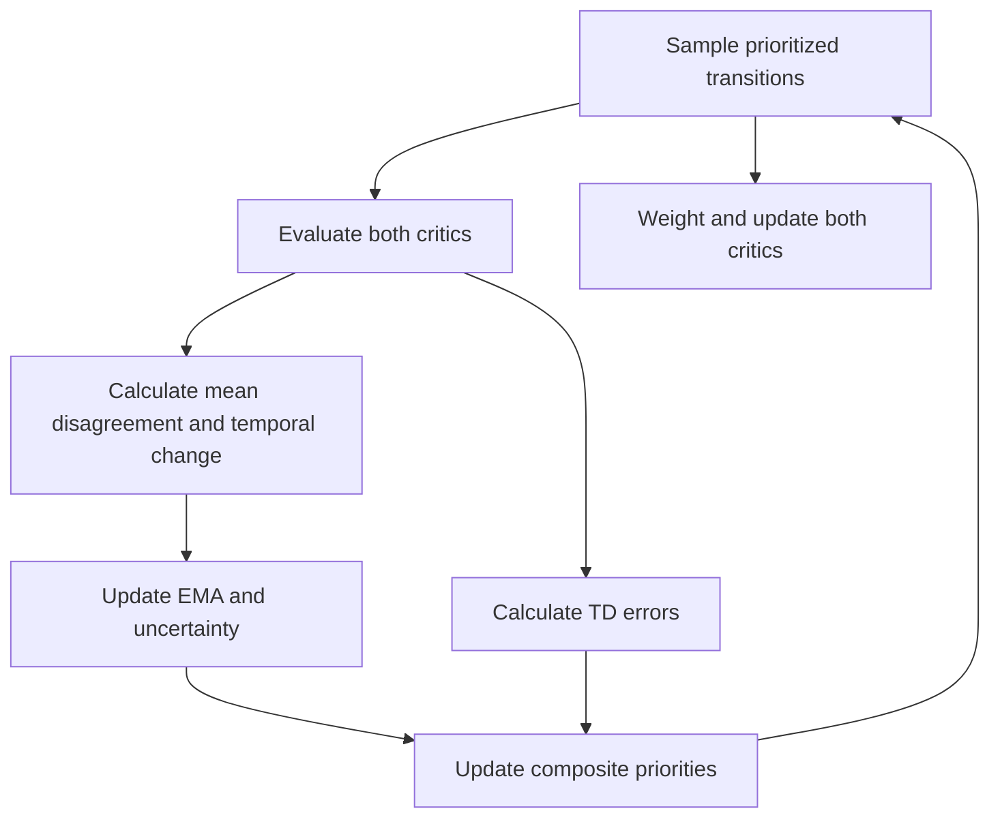

# FoD-DQ²

Please cite our work Yuzhou Lu and Yi Zuo: FoD-DQ2: First-order Difference of Dual Q-values based on Deep Q-learning with Prioritized Experience Replay for Multi-Criteria AUVs Path Planning, IEEE Sensors Journal, 2026.

https://doi.org/10.1109/JSEN.2026.3735319

https://ieeexplore.ieee.org/document/11713319


# FoD-DQ² for Three-Dimensional Underwater Robot Path Planning

This project investigates continuous-control path planning in a three-dimensional underwater environment. Its central method, **FoD-DQ²** (first-order difference of dual Q-values), measures temporal changes in disagreement between two independently trained critic networks. It uses the resulting uncertainty estimate to adjust prioritized experience replay (PER): transitions with large temporal-difference (TD) errors receive higher priority, whereas transitions updated during unstable value estimation are down-weighted.

## Project files

| File | Purpose |
| --- | --- |
| `train.py` | Selects the algorithm, environment difficulty, and episode count; saves models and training statistics. |
| `TD3_S.py` | FoD-DQ² path: tracks temporal variation in batch-mean dual-critic disagreement. Configurable replay settings can also support a conventional TD-error PER comparison. |
| `PER_Sumtree.py` | SumTree-based prioritized replay, importance-sampling weights, and priority updates. |
| `TD3_V.py` | Comparison path using normalized disagreement between the two critics for each transition. |
| `TD3_E.py` | Comparison path using prediction variance from five critic probes. |
| `underwater_model_env.py` | Underwater dynamics, spherical obstacles, reward computation, and visualization. |
| `visualize.py` | Training and trajectory visualization. |

FoD-DQ² specifically captures the *temporal change* in batch-mean disagreement.

## How the first-order difference affects replay priority

### Dual-critic disagreement

$$
\Delta\bar{Q}_t=\frac{1}{\mathcal{B}}\sum_{j=1}^{\mathcal{B}}\left|Q_{1,t}(s_j,a_j)-Q_{2,t}(s_j,a_j)\right|.
$$

The mean absolute difference quantifies disagreement on the current minibatch; it is not a transition-level uncertainty estimate.

### First-order temporal difference

$$
D_t=\nabla_t\!\left(\Delta\bar{Q}\right)=\Delta\bar{Q}_t-\Delta\bar{Q}_{t-1}.
$$

A positive value indicates increasing disagreement, and a negative value indicates decreasing disagreement. The uncertainty estimate uses $\widetilde D_t=|D_t|$, which retains the magnitude of the change. This temporal difference is not a gradient of a critic network.

### Exponential moving averages and uncertainty: 

$$
\begin{aligned}
\mu_{D_t}&=\lambda\mu_{D_{t-1}}+(1-\lambda)\widetilde D_t,\\
\upsilon_{D_t}&=\lambda\upsilon_{D_{t-1}}+(1-\lambda)\widetilde D_t^{\,2}.
\end{aligned} 
$$

Here, $0\leq\lambda<1$ is the decay factor. The online standard deviation and batch-level uncertainty are

$$
\sigma_{D_t}=\sqrt{\max\!\left(\upsilon_{D_t}-\mu_{D_t}^{2},\varepsilon_u\right)},
$$

$$
U_t=U_{\mathrm{diff},t}\mathbf{1}_{\mathcal{B}\times1}
=\frac{\widetilde D_t+\varepsilon_u}{\sigma_{D_t}+\varepsilon_u}\mathbf{1}_{\mathcal{B}\times1}.
$$

The constant $\varepsilon_u>0$ provides numerical stability. The scalar $U_{\mathrm{diff},t}$ is broadcast to all transitions in the current minibatch. Larger uncertainty indicates a more rapid change in mean critic disagreement relative to its recent variation. The prior README states that the implementation sets the first update to $U_t=1$ when no preceding disagreement statistic exists.

### Composite priority: 

For transition $j$ updated at step $t$, the paper uses the *maximum absolute TD error across both critics*:

$$
\begin{aligned}
\delta_{j,t}&=\max_{q\in\{1,2\}}\left|y_{j,t}-Q_{\theta_q}(s_j,a_j)\right|,\\
p_{j,t}&=\frac{\left(\delta_{j,t}+\varepsilon_p\right)^{\alpha}}{\left(U_t+1\right)^{\beta}},\\
\Pr_t(j)&=\frac{p_{j,t}}{\sum_{k\in\mathcal{D}}p_{k,t}}.
\end{aligned} 
$$

Here, $y_{j,t}$ is the target value, $\varepsilon_p>0$ prevents zero priority, $\alpha\geq0$ controls TD-error prioritization, $\beta\geq0$ controls uncertainty down-weighting, and $\mathcal{D}$ is the replay buffer. Setting $\beta=0$ removes the uncertainty term and recovers conventional TD-error PER. Within one update, $U_t$ rescales all sampled transitions equally; stored priorities from earlier updates can encode different uncertainty levels. A priority remains stored until that transition is updated again.

### Sampling and critic learning

`PERMemory.sample()` uses normalized stored priorities and stratified sampling over the SumTree. The normalized importance-sampling weight is

$$
\omega_j=\frac{[N\Pr_t(j)]^{-\xi}}{\max_{k\in\mathcal{B}}[N\Pr_t(k)]^{-\xi}},
$$

where $N$ is replay-buffer size and $\xi\in[0,1]$ controls correction for nonuniform sampling. Both critics use these weights in their squared-error losses. According to the original README, $\xi$ starts at 0.4 and increases by 0.001 per sampling call up to 1.0. Newly stored experiences receive the current maximum priority so that they can be sampled.



The first-order difference affects *subsequent replay sampling* through the stored priorities; it does not directly change either critic output or the target value.

## Training configuration

### Available command-line selections

| `--algorithm` | File | Replay or update mechanism |
| --- | --- | --- |
| `TD3` | `td3.py` | Uniform replay|
| `DDPG` | `ddpg.py` | Uniform replay|
| `DQN` | `dqn.py` | Uniform replay|
| `PPO` | `ppo.py` | Episode data are stored and used for an update after the episode. |
| `SAC` | `sac.py` | Can be instantiated; the existing training loop does not connect experience storage or training calls. |
| `TD3_PER` | `TD3_S.py` | FoD-DQ² path using first-order changes in batch-mean dual-critic disagreement. |
| `TD3_V_PER` | `TD3_V.py` | Comparison path using normalized, per-transition dual-critic disagreement. |
| `TD3_E_PER` | `TD3_E.py` | Comparison path using variance from five critic probes. |

### Difficulty and episode limits

| Difficulty | Spherical obstacles | Description |
| --- | ---: | --- |
| `easy` | 3 | Lower obstacle density. |
| `medium` | 6 | Default difficulty. |
| `hard` | 10 | Higher obstacle density. |

All difficulty settings share the start position `[0, 0, 0]`, goal `[8, 8, 8]`, and underwater dynamics parameters; obstacle number, positions, and radii vary. `--max_episodes` defaults to 1,000, with at most 1,000 steps per episode. A collision or entry into the 0.5 m goal region terminates an episode early. The prioritized-replay variants begin learning after more than 256 stored transitions and use a default minibatch size of 256.

### Run example

The existing project description specifies Python 3.10. Install the principal dependencies:

```bash
pip install numpy torch gymnasium matplotlib
```

Run the default FoD-DQ² path:

```bash
python train.py --algorithm TD3_PER --difficulty medium --max_episodes 1000 --run_id runN
```

The program initially displays the three-dimensional scene and waits for Enter before training. Results are saved under `result/runs/<run_id>/<algorithm>_<difficulty>/`: `models/` contains network weights, and `data/` contains rewards, path lengths, episode times, final trajectories, environment settings, and training statistics.

## Underwater environment

`underwater_model_env.py` provides the following functions.

| Function | Behavior |
| --- | --- |
| `__init__(difficulty='medium')` | Initializes three continuous thrust actions in `[-1, 1]`, a nine-dimensional observation (position, velocity, and relative position of the closest obstacle), physical parameters, a 0.1 s simulation step, disturbances, artificial potential field (APF) settings, and spherical obstacles. |
| `_generate_obstacles()` | Returns obstacle centers and radii for the selected difficulty. |
| `reset(seed=None)` | Resets position and velocity to zero, clears previous disturbance and APF values, and returns an observation and an empty information dictionary. An optional seed supports reproducibility. |
| `step(action)` | Scales the action by 20 to obtain thrust, incorporates disturbances and APF forces, applies resistance and buoyancy, updates motion, clips position to `[-10, 10]` and velocity to `[-2, 2]`, and evaluates collisions, reward, and goal attainment. Returns `(observation, reward, terminated, False, info)`. |
| `_apply_water_resistance()` | Applies velocity-dependent quadratic resistance. |
| `_apply_buoyancy()` | Updates vertical velocity from net buoyancy; documented default parameters give zero net buoyancy. |
| `_get_environmental_disturbance()` | Draws a zero-mean Gaussian force with depth-dependent standard deviation. |
| `_get_apf_force()` | Combines target attraction with obstacle repulsion and caps the force magnitude at `1e-3`. |
| `_get_obs()`, `_get_closest_obstacle()` | Identify the closest obstacle and construct the observation. |
| `_check_collision()` | Detects contact with any spherical obstacle. |
| `render()`, `close()` | Display and close the three-dimensional Matplotlib scene. |
